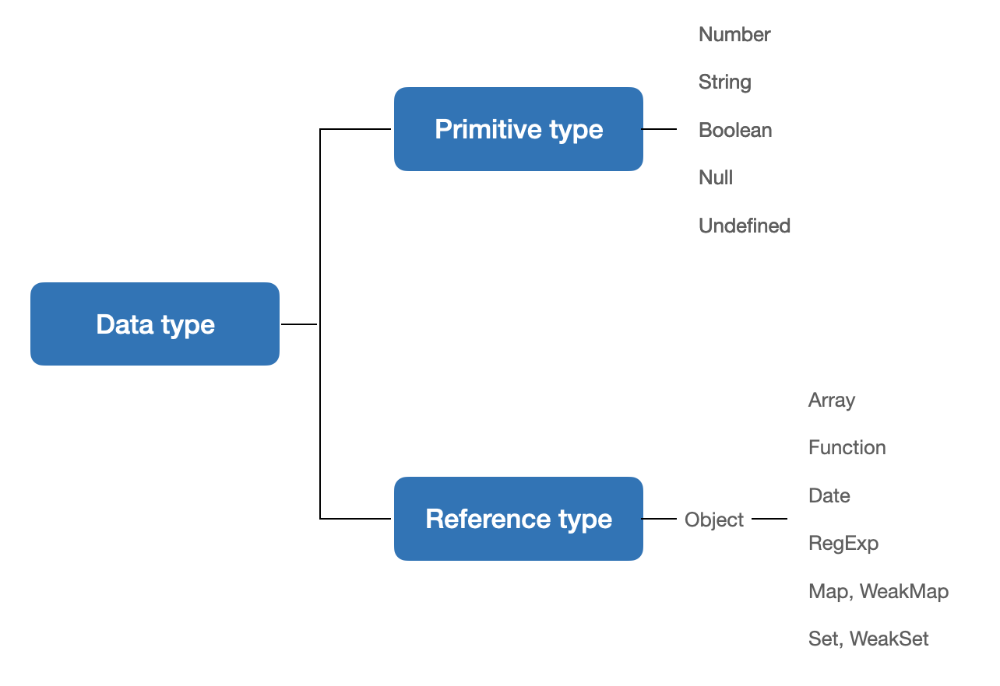

01 | 데이터 타입
===

해당 장은 자바스크립트가 데이터를 처리하는 과정을 살펴보는 장으로, 기본형 타입과 참조형 타입의 데이터가 서로 다르게 동작하는 이유를 이해하고, 이를 적절히 활용할 수 있는 것을 목표로 한다. 

나아가 데이터 타입과 관련된 중요한 개념 및 가지를 추가로 살핀다. 

---
01-1 | 데이터 타입의 종류
---
자바스크립트의 데이터 타입에는 크게 두 가지가 있다. 바로 기본형( 원시형, primitive type)과 참조형 ( reference type )이다. 

기본형에는 숫자(number), 문자열(string), 불리언(boolean), null, undefined 등이 존재하며, ES6에서는 심볼(symbol)이 추가되었다. 

참조형은 객체(object), 배열(Array), 함수(Function), 날짜(Date), 정규표현식(RegExp) 등과 ES6에서 추가된 Map, WeakMap, Set, WeakSet 등이 객체의 하위 분류에 속한다.

아래 그림은 자바스크립트의 데이터 타입의 종류를 정리한 것이다. 

일반적으로 기본형은 할당이나 연산시 복제되고, 참조형은 참조된다고 알려져있다. 
그러나 엄밀히 말하면 둘 모두 복제를 하지만 어떤 값을 복제하는지에 차이가 있다. 

기본형의 경우 값이 담긴 주솟값을 바로 복제하는 반면 참조형은 값이 담긴 주솟값들로 이루어진 묶음을 가리키는 주솟값을 복제한다는 점이 다르다.

기본형은 불변성(immutability)을 띈다.
기본형인 숫자 10을 담은 변수 a에 다시 숫자 15를 담으면 a의 값은 문제 없이 15로 변하는데, "변하지 않는다"는 것은 어떤 것을 의미하는가 라는 의문이 생길 수 있다. 

불변성을 잘 이해하려면 개략적으로나마 메모리와 데이터에 대한 지식이 필요하고, 나아가 "식별자"와 "변수"의 개념을 구분할 수 있어야 한다. 지금부터 배경지식을 얇게 깐 다음, 메모리 영역에서 자바스크립트의 데이터가 처리되는 과정을 살펴 볼 것이다.
