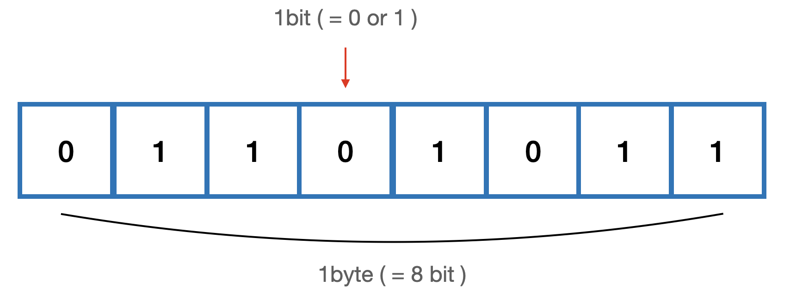

01-2 | 데이터 타입에 관한 배경지식
---
### 01-2-1 | 메모리와 데이터
컴퓨터는 모든 데이터를 0 또는 1로 바꿔 기억한다는 사실은 익히 알고 있을 것이다. 0 또는 1만 표현할 수 있는 하나의 메모리 조각을 비트(bit)라고 한다. 메모리는 매우 많은 비트들로 구성되어 있는데, 각 비트는 고유한 식별자(unique identifier)를 통해 위치를 확인할 수 있다.
그런데 고작 0과 1만으로 표현할 수 있는 비트 단위로 위치를 확인하는 것은 매우 비효율적이다. 그보다는 몇개씩 묶어 하나의 단위로 여긴다면 표현할 수 있는 값도 늘어나면서 동시에 검색 시간을 줄일 수 있다.

한편 매우 많은 비트를 한 단위로 묶으면 이번에는 검색 시간은 줄일 수도 있고 표현할 수 있는 데이터의 개수도 늘어나겠지만 동시에 낭비되는 비트가 생기기도 한다. 자주 사용하지 않을 데이터를 표현하기 위해 빈 공간을 남겨놓기보다는 표현 가능한 개수에 어느 정도 제약이 따르더라도 크게 문제가 되지 않을 적정한 공간을 묶는 편이 낫다. 이런 고민의 결과로 바이트(byte)라는 단위가 생겼다. 1byte는 8bit로 구성되어 있다.
1비트 마다 0또는 1의 두 가지 값을 표현할 수 있으므로 1byte는 총 256(2^8)개의 값을 표현할 수 있다. 2byte는 비트 16개임으로 65536(2^16)개의 값을 표현 할 수 있다.

C/C++, JAVA 등의 정적 타입 언언느 메모리의 낭비를 최소화 하기 위해 데이터 타입별로 할당할 메모리 영역을 2바이트, 4바이트 등으로 나누어 정해놓았다. 예를 들어, 2바이트 크기의 정수형 타입(short)은 0을 포함해 -32768 ~ +32767의 숫자만 허용한다. 만약 사용자가 +32768 또는 그 이상의 숫자를 입력하면 오류가 나거나 잘못된 값이 저장되고 만다.
이 문제에 제대로 대처하기 위해서는 사용자가 직접 4바이트 크기의 정수형 타입(int)등으로 형변환해야 한다. 사용자 입장에서는 꽤나 번거로운 작업이지만 메모리 용량이 매우 부족했던 시절에는 불가피한 선택이었다.

한편 메모리 용량이 과거보다 월등히 커진 상황에서 등장한 자바스크립트는 상대적으로 메모리 관리에 대한 압박에서 자유로워졌다. 그래서 메모리 공간을 좀 더 넉넉하게 할당했다. 숫자의 경우 정수형인지 부동소수형인지를 구분하지 않고 64비트, 즉 8바이트를 확보한다. 덕분에 개발자가 위와 같은 형변환을 걱정해야 하는 상황이 훨씬 덜 발생하게 되었다.

우리는 지금 컴퓨터에서 숫자형 데이터를 저장하는 방법을 개념적으로 알아보고 있다. 앞서 각 비트는 고유한 식별자를 지닌다고 했었다. 바이트 역시 시작하는 비트의 식별자로 위치를 파악할 수 있을 것이다. 모든 데이터는 바이트 단위의 식별자, 더 정확하게는
**메모리 주솟값(memory address)**
을 통해 서로 구분하고 연결할 수 있다.

---
### 01-2-2 | 식별자와 변수
보통 변수(variable)와 식별자(identifier)를 혼용하는 경우가 많다. 식별자라고 해야 할 곳에 변수를, 변수라고 해야 할 곳에 식별자를 쓰는 식으로 말이다.
혼용이 가능한 이유는 대부분의 경우에 문맥에 따라 무엇을 말하고자 하는지를 유추할 수 있기 때문이지만 둘의 차이를 모른다면 혼란스러울 수 있다.

**변수**
는 "변할 수 있는 수이다. 수학 용어를 차용했기 때문에 숫자를 의미하는 "수"가 붙었을 뿐, 반드시 "숫자"여야 하는 것은 아니다. 영어 단어 variable은 원래 "변할 수 있다."라는 형용사이지만 컴퓨터 용어로 쓸 때는 "변할 수 있는 무언가"라는 명사로 확장시켰다.
여기서 "무언가"란
**데이터**
를 의미한다. 숫자도 데이터이고, 문자열, 객체, 배열 모두 데이터이다.
**식별자**
는 어떤 데이터를 식별하는데 사용하는 이름, 즉 
**변수명**
이다.

