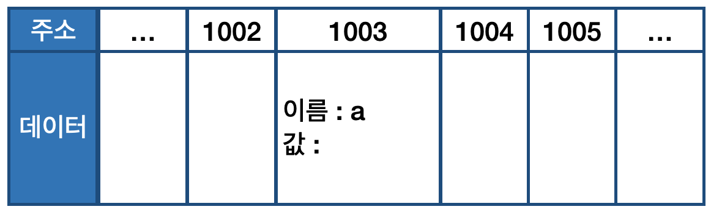
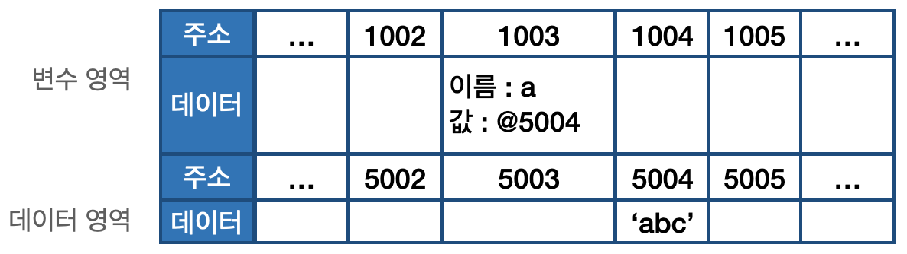
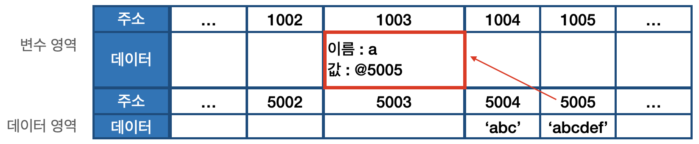

01-3 | 변수 선언과 데이터 할당
---
### 01-3-1 | 변수 선언
해당 장에서는 변수 선언 방법에 대한 것이 아닌 변수 선언 동작 원리에 대해 알아본다. 우선 기본적인 변수 선언식을 예로 들어 살펴본다.

```
// 예제 1-1 | 변수 선언
01 var a;
```

예제 101을 말로 풀어쓰면 
**"변할 수 있는 데이터를 만든다. 이 데이터의 식별자는 a로 한다."**
가 된다. 변할 수 있는 데이터이니 선언할 때는 undefined 이더라도 나중에 다른 값으로 바꾸면 된다. 
이렇게 보면 변수란 결국
**변경 가능한 데이터가 담길 수 있는 공간 또는 그릇**
이라고 생각 할 수 있다. 해당 공간에 숫자를 담았다가 문자열을 담는 등의 다양한 명령을 내릴 수 있다. 

이를 바탕으로 컴퓨터가 예제 1-1의 명령을 받아 메모리 영역에서 어떤 작업을 수행하는지를 아래 그림 1-3으로 표햔해 본다. 
다만 실제 메모리 구조를 모두 그대로 그리는 것은 비효율적이며, 이해하기 어렵기 때문에 "자바스크립트의 데이터 구조 이해"라는 목적을 달성에 필요할 만큼만 개략적으로 표현한다.

그림 1-3 | 변수 선언에 대한 메모리 영역의 변화



예제 1-1의 명령을 받은 컴퓨터는 메모리에서 비어있는 공간 하나를 확보한다. 그림 1-3에서는 임의로 1003번으로 정했다. 이 공간의 이름(식별자)을 a라고 지정한다. 여기까지가 변수 선언 과정이다. 이후에 가용자가 a에 접근하고자 하면 컴퓨터는 메모리에서 a라는 이름을 가진 주소를 검색해 해당 공간에 담긴 데이터를 반환할 것이다.

---
### 01-3-2 | 데이터 할당
```
// 에제 1-2 | 변수 선언과 할당
01 var a;          // 변수 a 선언 
02 a = 'abc';      // 변수 a에 데이터 할당
03 
04 var a = 'abc';  // 변수 선언과 할당을 한 문장으로 표현
```

선언과 할당을 예제 1-2의 1, 2번재 줄과 같이 두 문장으로 나누어 명령하든 4번째 줄과 같이 한 문장으로 명령하든, 자바스크립트 엔진은 결국 같은 동작을 수행한다.
메모리에서 비어있는 공간을 확보하고 그 공간의 이름을 설정하는 선언 과정은 앞서 살펴본 것과 같다. 이어서 할당하는 과정이다. a라는 이름을 가진 주소를 검색해서 그곳에 문자열 'abc'를 할당하면 될 것 같아 보인다.
그러나 실제 동작은 그렇지 않다.

실제로는 해당 위치에 문자열 'abc'를 직접 저장하지 않는다. 데이터를 저장하기 위한 별도의 메모리 공간을 다시 확보해서 문자열 'abc'를 저장하고, 그 주소를 변수 영역에 저장하는 식으로 동작이 이루어진다. 이제부터는 데이터의 성질에 따라 '변수 영역, '데이터 영역'으로 구분해서 설명할 것이다. 

데이터 할당의 전체 흐름은 다음과 같다. 그림 1-4와 함께 순서대로 다라가 볼 것이다. 


1. 변수 영역에서 빈 공간(@1003)을 확보한다.
2. 확보한 공간의 식별자를 a로 지정한다.
3. 데이터 영역의 빈 공간(@5004)에 문자열 'abc'를 저장한다.
4. 변수 영역에서 a라는 식별자를 검색한다.(@1003).
5. 앞서 저장한 문자열의 주서 (@5004)를 @1003의 공간에 대입한다.


왜 변수 영역에 값을 직접 대입하지 않고 굳이 번거롭게 한 단계를 더 거치는 걸까? 이는 데이터 변환을 자유롭게 할 수 있게 함과 동시에 메모리를 더욱 효율적으로 관리하기 위한 고민의 결과이다. 1-2-1 절에서 자바스크립트는 숫자형 데이터에 대해 64비트(8 바이트)의 공간을 확보한다고 했다.
반면 문자열은 특별히 정해진 규격이 없다. 한 글자마자 영어는 1바이트, 한글은 2바이트 등으로 각각 필요한 메모리 용량이 가변적이며 전체 글자 수 역시 가변적이기 때문이다.

만약 미리 확보한 공간 내에서 데이터 변환을 할 수 있다면 변환한 데이터를 다시 저장하기 위해서는 '확보된 공간을 변환된 데이터 크기에 맞게 늘리는 작업'이 선행되어야 할 것이다. 
해당 공간이 메모리 상의 가장 마지막에 있었다면 뒤쪽으로 늘리기만 하면 되니까 어렵지 않겠지만 중간에 있는 데이터를 늘려야 하는 상황이라면 어떨까? 해당 공간보다 뒤에 저장된 데이터들을 전부 뒤로 옮기고, 이동시킨 주소를 각 식별자에 다시 연결하는 작업을 해야 한다. 
컴퓨터가 처리해야 할 연산이 많아질 수밖에 없다. 결국 효율적으로 문자열 데이터의 변환을 처리하려면 변수와 데이터를 별도의 공간에 나누어 저장하는 것이 최적이다.

문자열 'abc'의 마지막에 'def'를 추가하라고 하면 컴퓨터는 앞서 'abc'가 저장된 공간에 'abcdef'를 할당하는 대신 'abcdef'라는 문자열을
**새로** 
만들어 별도의 공간에 저장하고, 그 주소를 변수 공간에 연결한다. (그림 1-5).
반대로 'abc'의 마지막 'c'를 제거하라고 해도 새로 만든다. 기존 문자열에 어떤 변환을 가하든 상관 없이 무조건 새로 만들어 별도의 공간에 저장한다.



다른 예로 500갸의 변수를 생성해서 모든 변수에 숫자 5를 할당하는 상황을 생각해 보자.
각 변수를 별개로 인식하려면 500개의 변수 공간을 확보하는 것은 불가피하다. 그런데 각 변수 공간마다 매번 숫자 5를 할당하려고 하면 숫자형은 8바이트가 필요하다고 했으니까 총 4000(500x8)바이트를 써야 할 것이다. 그 대신 5를 별도의 공간에 한 번만 저장하고 해당 주소만 입력한다면 어떨까? 
예를 들어, 주소 공간의 크기가 2바이트라고 한다면 1008(500x2+8)바이트만 이용하면 된다. 이처럼 변수 영역과 데이터 영역을 분리하면 중복된 데이터에 대한 처리 효율이 높아진다. 
