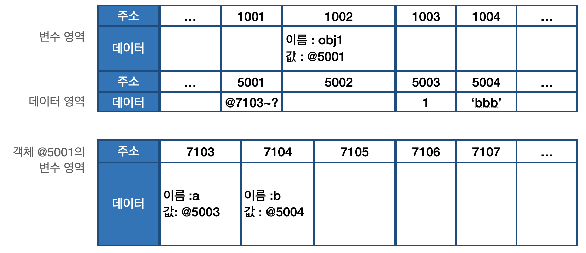
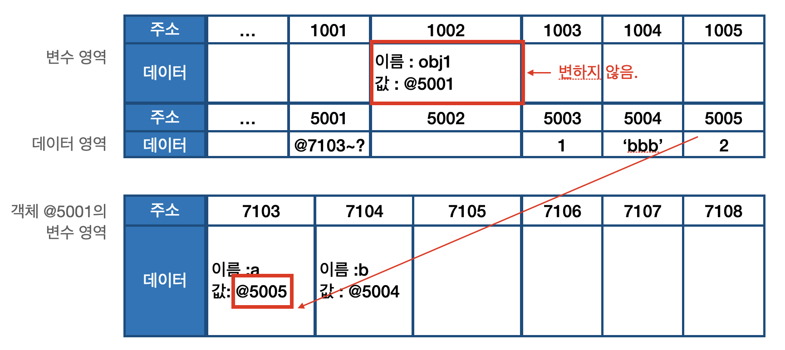
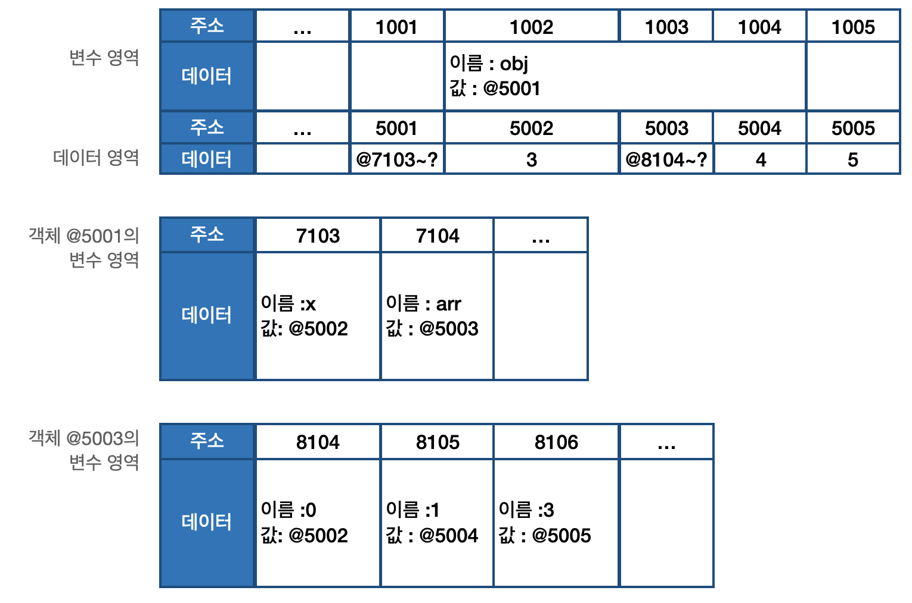
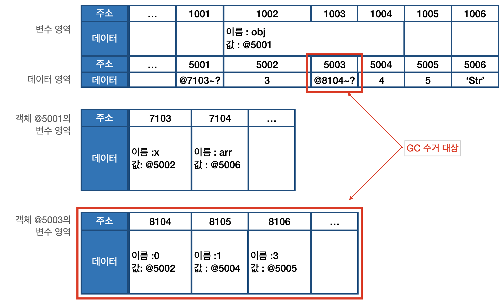
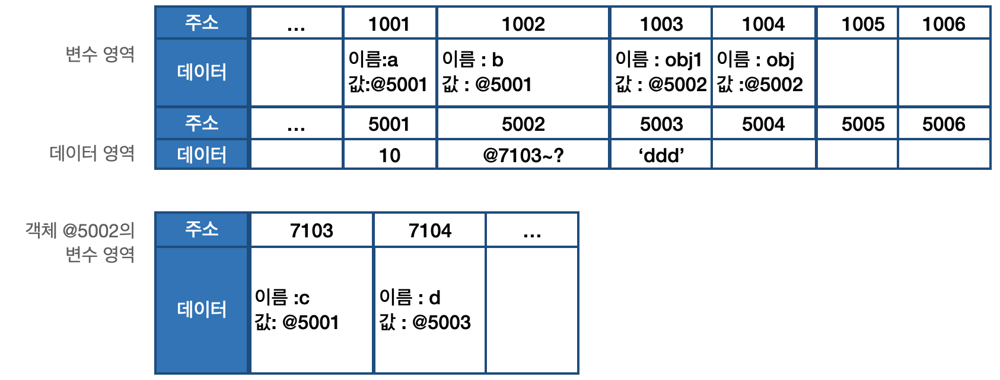
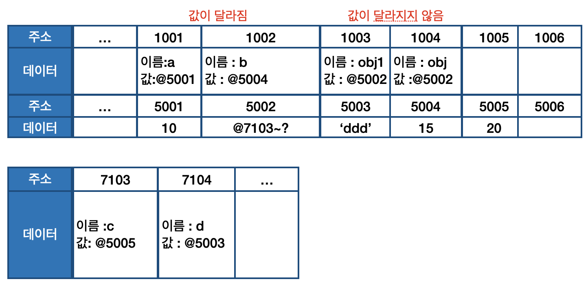
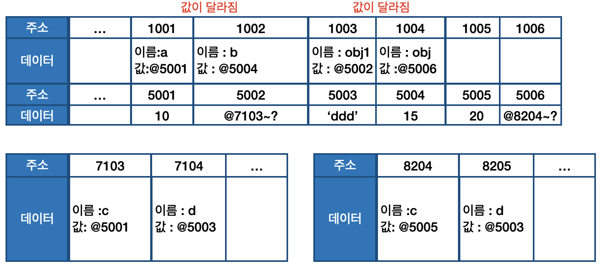

01-4 | 기본형 데이터와 참조형 데아터
---
### 01-4-1 | 불변값

변수(variable)와 상수(constant)를 구분하는 성질은 "변경 가능성"이다. 
바꿀 수 있으면 변수, 바꿀 수 없으면 상수이다. 
불변값과 상수를 같은 개념으로 오해하기 쉬운데, 이 둘을 명확하게 구분할 필요가 있다. 
변수와 상수를 구분 짓는 변경 가능성의 대상은 
**변수 영역**
메모리이다.
한 번 데이터 할당이 이루어진 변수 공간에 다른 데이터를 재할당할 수 있는지 여부가 관건이다. 반면 불변성 여부를 구분할 때의 변경 가능성의 대상은 
**데이터 영역**
메모리이다. 

기본형 데이터인 숫자, 문자열, boolean, null, undefined, Symbol은 모두 불변값이다. 
그 중 숫자와 문자열을 예로 들어 불변성의 개념을 알아볼 것이다.
```
// 예제 1-3 불변성
01 var a = 'abc';
02 a = a + 'def';
03
04 var b = 5;
05 var c = 5;
06 b = 7;
```

우선 예제 1-3의 1~2번째 줄을 볼 것이다. 변수 a에 문자열 'abc'를 할당했다가 뒤에 'def'를 추가하면 기존의 'abc'가 'abcdef'로 바뀌는 것이 아니라 새로운 문자열 'abcdef'를 만들어 그 주소를 변수 a에 저장한다. 
'abc'와 'abcdef'는 완전히 별개의 데이터이다.

4번째 줄에서는 변수 b에 숫자 5를 할당한다. 그러면 컴퓨터는 일단 데이터 영역에서 5를 찾고, 없으면 그제서야 데이터 공간을 하나 만들어 저장한다. 그 주소를 b에 저장한다. 
5번째 줄에서는 다시 같은 수인 5를 할당하려고 한다. 컴퓨터는 데이터 영역에서 5를 찾는다. 4번째 줄에서 이미 만들어 놓은 값이 있으니 그 주소를 재활용한다.

6번째 줄에서는 변수 b의 값을 7로 바꾸고자 한다. 그러면 기존에 저장된 5자체를 7로 바꾸는 것이 아니라 기존에 저장했던 7을 찾아서 있으면 재활용하고, 없으면 새로 만들어서 b에 저장한다. 결국 5와 7모두 다른 값으로 변경할 수 없다.

이처럼 문자열 값도 한 번 만든 값을 바꿀 수 없고, 숫자 값도 다른 값으로 변경할 수 없다. 변경은 새로 만드는 동작을 통해서만 이루어진다. 이것이 바로 불변값의 성질이다. 한 번 만들어진 값은 가비지 컬렉팅을 당하지 않는 한 영원히 변하지 않는다.

---
### 01-4-2 | 가변값
기본현 데이터는 모두 불변값이라고 했다. 그렇다면 참조형 데이터는 모두 가변값일 것 같은 느낌이 든다.
기본적인 성질은 가변값인 경우가 많지만 설정에 따라 변경 불가능한 경우도 있고, 아예 불변값을 활용하는 예외적인 방안은 본 장의 마지막 절에서 다루기도 하고, 지금은 우선 참조형 데이터를 변수에 활당하는 과정부터 확인해 볼 것이다.

```
// 예제 1-4 | 참조형 데이터의 할당
01 var obj1 = {
02      a  1,
03      b : 'bbb'
04 };
```

그림 1-6



1. 컴퓨터는 우선 변수 영역의 빈 공간(@1002)을 확보하고, 그 주소의 이름을 obj1로 지정한다.
2. 임의의 데이터 저장 공간(@5001)에 저장하려고 보니 여러 개의 프로퍼티로 이뤄진 데이터 그룹이다. 이 그룹 내부의 프로퍼티들을 저장하기 위해 별도의 변수 영역을 마련하고, 그 영역의 주소(@7103 ~ ? )를 @5001에 저장한다.
3. @7103 및 @7104에 각각 a와 b라는 프로퍼티 이름을 지정한다.
4. 데이터 영역에서 숫자 1을 검색한다. 검색 결과가 없으므로 임의로 @5003에 저장하고, 이 주소를 @7103에 저장한다. 문자열 'bbb' 역시 임의로 @5004에 저장하고, 이 주소를 @7104에 저장한다.

기본형 데이터와의 차이는 '객체의 변수(프로퍼티) 영역'이 별도로 존재한다는 점이다.
그림을 자세히 보면 객체가 별도로 할애한 영역은 변수 영역일 뿐 '데이터 영역'은 기존의 메모리 공간을 그대로 활용하고 있다. 데이터 영역에 저장된 값은 모두 불변값이다. 
그러나 변수에는 다른 값을 얼마든지 대입할 수 있다. 바로 이 부분 때문에 흔히 참조형 데이터는 불변(immutable)하지 않다(가변값이다)라고 하는 것이다.
예제로 확인해보자.

```
// 예제 1-5 | 참조형 데이터의 프로퍼티 재할당
01 var obj1 = {
02      a:1,
03      b:'bbb'
04 };
05 obj1.a = 2;
```

4번째 줄까지는 앞서 살펴본 내용이니 5번째 줄만 확인해보면, obj1의 a 프로퍼티에 숫자 2를 할당하려고 한다. 
데이터 영역에서 숫자 2를 검색한다. 검색 결과가 없으므로 빈 공간인 @5005에 저장하고, 이 주소를 @7103에 저장한다. 
4번째 줄의 명령 전과 후에 변수 obj1이 바라보고 있는 주소는 @5001로 변하지 않았다. 
즉 '새로운 객체'가 만들어진 것이 아니라 기존의 객체 내부의 값만 바뀐 것이다.

그림 1-7 | 참조형 데이터의 프로퍼티 재할당


이번에는 참조형 데이터의 프로퍼티에 다시 참조형 데이터를 할당하는 경우를 살펴볼 것이다. 참고로 이런 경우를 중첩 객체(nested object)라고 부른다.

```
// 예제 1-6 | 중첨된 참조형 데이터(객체)의 프로퍼티 할당
01 var obj = {
02      x:3,
03      arr :[3,4,5]
04 };
```
1. 컴퓨터는 우선 변수 영역의 빈 공간(@1002)을 확보하고, 그 주소의 이름을 Obj로 지정한다.
2. 임의의 데이터 저장공간(@5001)에 데이터를 저장하려는데, 이 데이터는 여러 개의 변수와 값들을 모아놓은 그룹(객체)이다. 이 그룹의 각 변수(프로퍼티)들을 저장하기 위해 별도의 변수 영역을 마련하고(@7103~?), 그 영역의 주소를 @5001에 저장한다.
3. @7103에 이름 x를, @7104에 이름 arr를 지정한다.
4. 데이터 영역에서 숫자 3을 검색한다. 없으므로 임의로 @5002에 저장하고, 이 주소를 @7103에 저장한다.
5. @7104에 저장할 값은 배열로서 역시 데이터 그룹이다. 이 그룹 내부의 프로퍼티들을 저장하기 위해 별도의 변수 영역을 마련하고(@8104~?), 그 영역의 주소 정보(@8104~?)를 @5003에 저장한 다음, @5003을 @7104에 저장한다.
6. 배열의 요소가 총 3개이므로 3개의 변수 공간을 확보하고 각각 인덱스를 부여한다.(0,1,2)
7. 데이터 영역에서 숫자 3을 검색해서 (@5002) 그 주소를 @8104에 저장한다.
8. 데이터 영역에 숫자 4가 없으므로 @5004에 저장하고, 이 주소를 @8105에 저장한다.
9. 데이터 영역에 숫자 5가 없으므로 @5005에 저장하고, 이 주소를 @8106에 저장한다.

그림 1-8 | 중첩된 참조형 데이터(객체)의 프로퍼티 할당


이제 obj.arr[1]을 검색하고자 하면 메모리에서는 다음과 같은 검색 과정을 거친다.

1. obj 검색 1 : obj 라는 식별자를 가진 주소를 찾는다. (@1002)
2. obj 검색 2 : 값이 주소이므로 그 주소로 이동한다. (@5001)
3. obj 검색 3 : 값이 주소이므로 그 주소로 이동한다. (@7103~?)
4. obj.arr 검색 1 : arr이라는 식별자를 가진 주소를 찾는다. (@7004)
5. obj.arr 검색 2 : 값이 주소이므로 그 주소로 이동한다. (@5003).
6. obj.arr 검색 3 : 값이 주소이므로 그 주소로 이동한다. (@8104~?)
7. obj.arr[1] 검색 1 : 인덱스 1에 해당하는 주소를 찾는다. (@8105)
8. obj.arr[1] 검색 2 : 값이 주소이므로 그 주소로 이동한다. (@5004)
9. obj.arr[1] 검색 3 : 값이 숫자형 데이터이므로 4를 반환한다.

```
@1002 → @5001 → (@7103~?) → @7104 → @5003 → (@8104~?) → @8105 → @5004 → 4 반환 
```

만약 이 상태에서 다음과 같이 재할당 명령을 내리면 어떻게 될까?
```
obr.arr = 'str;
```
@5006에 문자열 'str'을 저장하고, 그 주소를 @7104에 저장한다. 그러면 @5003은 더이상 자신의 주소를 참조하는 변수가 하나도 없게 된다. 어떤 데이터에 대해 자신의 주소를 참조하는 변수의 개수를 참조 카운트라고 한다. @5003의 참조 카운트는 @7104에 @5003이 저장돼 있던 시점까지 1이었다가 @7104에 @5006이 저장되는 순간 0이 된다.
가비지 컬렉터는 런타임 환경에 따라 특정 시점이나 메모리 사용량이 포화 상태에 임박할 때마다 자동으로 수거 대상들을 수거(collecting)한다. 
수거된 메모리는 다시 새로운 값을 할당할 수 있는 빈 공간이 된다.

즉, @5003은 참조 카운트가 0이 됨에 따라 GC 대상이 되고, 이후 언젠가 담겨 있던 데이터인 "@8104~?"라는 값이 사라진다. 이 과정에서 연쇄적으로 @8104~?의 각 데이터들의 참조 카운트가 0이 되고, 이들 역시 CG의 대상이 되어 함께 사라질 것이다.

그림 1-9 | 중첨된 참조형 데이터(객체)의 프로퍼티 재할당


---
### 01-4-3 변수 복사 비교
동작 방식을 알았으니 이제 본격적으로 기본형 데이터와 참조형 데이터의 차이를 확인해 볼 차례이다. 먼저 변수를 복사할 때의 변화를 살펴볼 것이다.

```
// 예제 1-7 | 변수 복사
01 var a = 10;
02 var b = a;
03
04 var obj1 = { c : 10, d : 'ddd' };
05 var obj2 = obj1;
```



우선 기본형 데이터부터 볼 것이다. 1번째 줄에서는 변수 영역의 빈 공간 @1001을 확보하고 식별자를 a로 지정한다. 숫자 10을 데이터 영역에서 검색하고 없으므로 빈 공간 @5001에 저장한 다음, 이 주소를 @1001에 넣습니다. 이로써 기본형 데이터에 대한 변수 선언 및 할당이 종료된다.

이제 복사를 할 차례이다. 변수 영역의 빈 공간 @1002를 확보하고 식별자를 b로 지정한다. 이제 식별자 a를 검색해 그 값을 찾아와야 한다. @1001에 저장된 값인 @5001을 들고 좀 전에 확보해둔 @1002에 값으로 대입한다. 

다음으로 참조형 데이터를 볼 것이다. 4번째 줄에서는 변수 영역의 빈 공간 @1003을 확보해 식별자를 obj1로 지정한다. 데이터 영역의 빈 공간 @5002을 확보하고, 데이터 그룹이 담겨야 하기 때문에 별도의 변수 영역 @7103~을 확보해 그 주소를 저장한다. @7103에는 식별자 c를, @7104에는 식별자 d를 입력한 다음, c에 대입할 값 10을 데이터 영역에서 검색한다.
@5001에 이미 저장돼 있으므로 이 주소를 @7103에 연결하고, 문자열인 'ddd'는 데이터 영역의 빈 공간에 새로 만들어서 @7104에 연결한다. 여기까지가 참조형 데이터인 객체에 대한 변수 선언 및 할당 과정이다.

5번째 줄에서는 변수 영역의 빈 공간 @1004를 확보하고, 식별자를 obj2로 지정한다. 이제 식별자 obj1을 검색해 (@1003) 그 값인 @5002를 들고, @1004에 값으로 대입한다.

변수를 복사하는 과정은 기본형 데이터와 참조형 데이터 모두 같은 주소를 바라보게 되는 점에서 동일하다. @1001과 @1002는 모두 값이 @5001이 됐고, @1003과 @1004에는 모두 값이 @5002가 됐다. 복사 과정은 동일하지만 데이터 할당 과정에서 이미 차이가 있기 때문에 변ㅅ 복사 이후의 동작에도 큰 차이가 발생한다. 

```
// 예제 1-8 | 변수 복사 이후 값 변경 결과 비교 (1) - 객체의 프로퍼티 변경 시
01 var a = 10;
02 var b = a;
03 var obj1 = { c:10, d:"ddd" };
04 var obj2 = obj1;
05
06 b = 15;
07 obj2.c = 20;
```

이번에는 먼저 그림 없이 코드를 바탕으로 흐름을 따라가 볼 것이다. 1번째 줄부터 4번째 줄까지는 예제 1-7과 같다.

6번째 줄에서는 데이터 영역에 아직 15가 없으므로 새로운 공간 @5004에 저장하고, 그 주소를 든 채로 변수 영역에서 식별자가 b인 주소를 찾는다. 
@1002의 값이 @5004가 된다. 

7번째 줄에서는 데이터 영역에 아직 20이 없으므로 새로운 공간 @5005에 저장하고, 그 주소를 든 채로 변수 영역에서 obj2를 찾고(@1004), obj2의 값인 @5002가 가리키는 변수 영역에서다시 c를 찾아(@7103) 그곳에 @5005를 대입한다.

그림 1-11 | 변수 복사 이후 값을 변경했을 때의 차이점 (1) - 객체의 프로퍼티를 변경했을 때


기본형 데이터를 복사한 변수 b의 값을 바꿨더니 @1002의 값이 달라진 반면, 참조형 데이터를 복사한 변수 obj2의 프로퍼티의 값을 바꾸었더니 @1004의 값은 달라지지 않았다. 즉, 변수 a와 변수 b는 서로 다른 주소를 바라보게 됐으나, 변수 obj1과 obj2는 여전히 같은 객체를 바라보고 있는 상태이다. 이를 코드로 표현하면 다음과 같다.
```
a !== b
obj1 === obj2
```

이 결과가 바로 기본형과 참조형 데이터의 가장 큰 차이점이다. 대부분의 자바스크립트 책에서 '기본형은 값을 복사하고 참조형은 주솟값을 복사한다'고 설명하고 있지만, 사실은 어떤 데이터 타입이든 변숭 할당하기 위해서는 주솟값을 복사해야 하기 때문에, 엄밀히 따지면 자바스크립트의 모든 데이터 타입은 참조형 데이터일 수밖에 없다. 다만 기본형은 주솟값을 복사하는 과정이 한 번만 이루어지고, 참조형은 한 단계를 더 거치게 된다는 차이가 있다.

일반적으로는 '기본형도 결국 주소값을 참조한다.'는 사실을 소개하지 않는데, 그 이유는 이해하기에 다소 어려움이 있기 때문이라고 추측한다. 그러나 이런 내부 원리를 잘 이해하는 것은 향후 중급 개발자로 성장하는 과정에서 더 큰 혼란을 느끼지 않기 위한 중요한 초석이 될 것이다.

예제 1-8에서 한 가지 더 짚고 넘어갈 내용이 있다. 예제 1-8은 변수의 값(b)을 직접 변경할 때와 값이 아닌 내부 프로퍼티(obj2.c)를 변경할 때의 결과를 비교한 것이다. 가만 보면 애초에 비교 대상의 조건 자체가 서로 다르니 동작도 다른게 당연할 수밖에 없다. 같은 조건인 상태에서 비교하면 어떨지도 확인해 보자.
```
// 예제 1-9 | 변수 복사 이후 값 변경 결과 비교 (2) - 객체 자체를 변경했을 때
01 var a = 10;
02 var b = a;
03 var obj1 = {c:10, d:'ddd'};
04 var obj2 = obj1;
05 
06 b = 15;
07 obj2 = { c :20, d:'ddd' };
```

이번에는 b의 경우와 마찬가지로 obj2에도 새로운 객체를 할당함으로써 값을 직접 변경했습니다. 그러면 메모리의 데이터 영역의 새로운 공간에 새 객체가 저장되고 그 주소를 변수 영역의 obj2 위치에 대해 저장하겠죠. 객체에 대한 변경임에도 값이 달라졌습니다.


즉, 참조형 데이터가 '가변값'이라고 설명할 때의 '가변'은 참조형 데이터 자체를 변경할 경우가 아니라 그 내부의 프로퍼티를 변경할 때만 성립된다.
