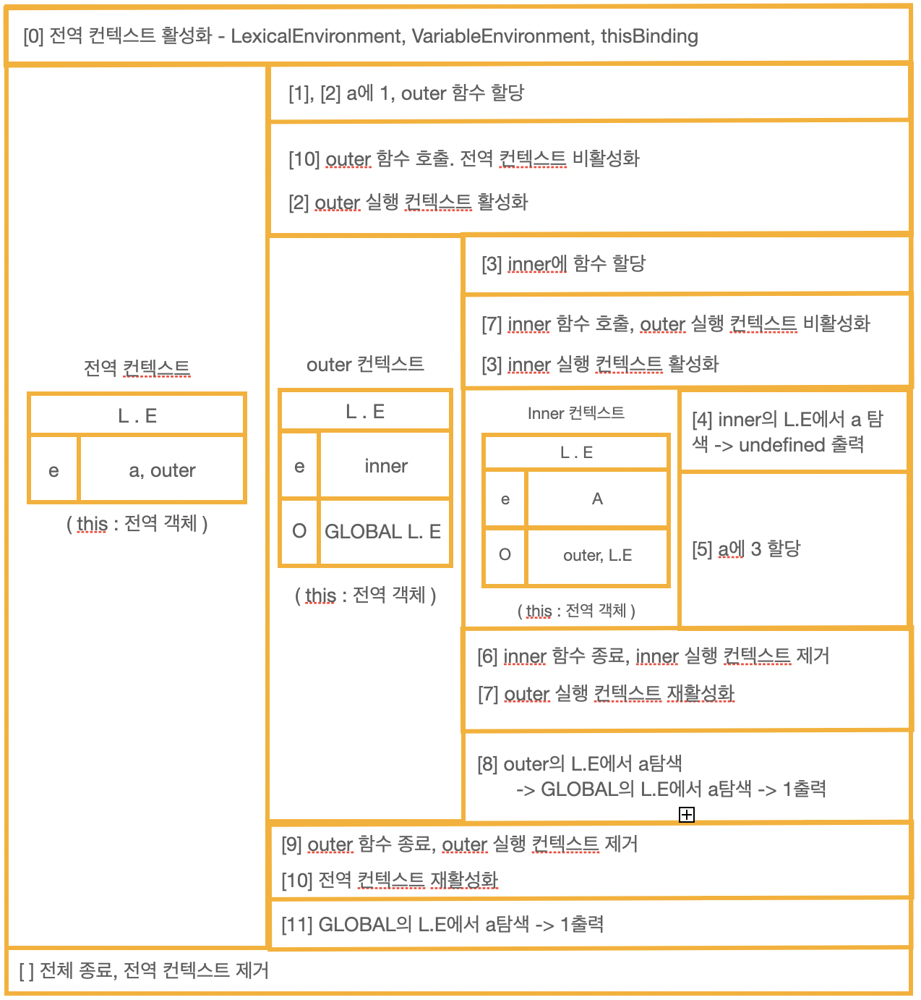
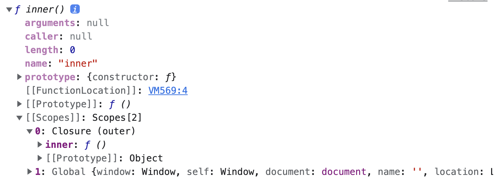
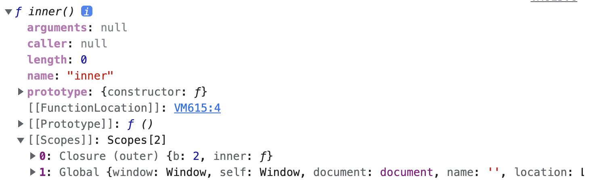
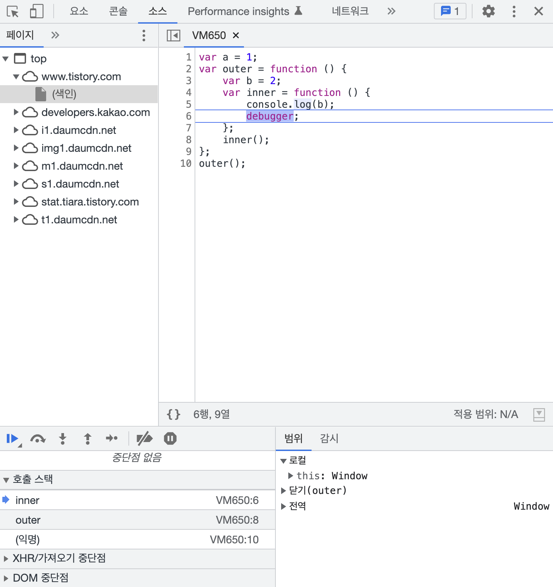

02-3 | LexicalEnvironment
---
lexical environment에 대한 한국어 번역은 문서마다 제각각 다른데 '어휘적 환경', '정적 환경'이라는 단어가 가장 많이 등장한다.
'어휘적'은 lexical을 영어사전에 대입해서 치환한 것으로 의미가 와 닿지 않고, '정적'이라는 말은 수시로 변하는 환경 정보를 의미하는 lexical environment에 대한 적절한 번역이라고 볼 수 없다.
이보다는 '사전적인'이 더욱 어울리는 표현이라고 생각한다. 예를 들어 백과사전에 '바나나'를 검색하면 가장 먼저 '칼로리가 가장 높고 당질이 많은 알칼리성 식품으로 칼륨, 카로틴, 비타민C를 함유하고 있다'라는 문구가 등장한다.
이와 같은 느낌으로 이해하면 되는데, 즉 '현재 컨텍스트의 내부에는 a,b,c와 같은 식별자들이 있고 그 외부 정보는 D를 참조하도록 구성돼있다'라는, 컨텍스트를 구성하는 환경 정보들을 시전에서 접하는 느낌으로 모아놓은 것이다.

이해를 돕기 위한 차원에서 길게 설명했지만 '사전적 환경'이라는 번역은 필자의 사견일 뿐이다. 어떤 용어를 대할 때 '개인의 이해를 위한 용어'와 '타인과의 커뮤니케이션을 위한 용어'를 구분할 필요가 있는데, '사전적 환경'은 어디까지나 전자에 해당하며, 후자를 위해서는 가급적 원어를 문자 그대로 받아들이는 편이 좋다.
variable environment 역시 마찬가지로 '변수 환경'이 아닌 variable environment라는 원어를 그대로 사용하겠다.

---
### 02-3-1 | environmentRecord와 호이스팅

environmentRecord에는 현재 컨텍스트와 관련된 코드의 식별자 정보들이 저장된다. 컨텍스트를 구성하는 함수에 지정된 매개변수 식별자, 선언한 함수가 있을 경우 그 함수 자체, var로 선언된 변수의 식별자 등이 식별자에 해당한다. 컨텍스트 내부 전체를 처음부터 끝까지 쭉 훑어나가며 **순서대로** 수집한다.

```text
참고

전역 실행 컨텍스트는 변수 객체를 생성하는 대신 자바스크립트 구동 환경이 별도로 제공하는 객체, 즉 전역 객체를 활용한다.
전역 객체에는 브라우저의 window, Node.js의 global 객체 등이 있다. 
이들은 자바스크립트 내장 객체가 아닌 호스트 객체로 분류된다.
```

변수 정보를 수집하는 과정을 모두 마쳤더라도 아직 실행 컨텍스트가 관여할 코드들은 실행되기 전의 상태이다. 코드가 실행되기 전임에도 불구하고 자바스크립트 엔진은 이미 해당 환경에 속한 코드의 변수명들을 모두 알고 있게 되는 셈이다.
그렇다면 엔진의 실제 동작 방식 대신에 '자바스크립트 엔진은 식별자들을 최상단으로 끌어올려 놓은 다음 실제 코드를 실행한다.'라고 생각하더라도 코드를 해석하는 데는 문제될 것이 전혀 없을 것이다. 
여기서 호이스팅(Hoisting)이라는 개념이 등장한다. 호이스팅이란 '끌어올리다'라는 의미의 hoist에 ing를 붙여 만든 동명사로, 변수 정보를 수집하는 과정을 더욱 이해하기 쉬운 방법으로 대체한 가상의 개념이다. 자바스크립트 엔진이 실제로 끌어올리지는 않지만 편의상 끌어올린 것으로 간주하자는 것이다. 

---
####호이스팅 규칙
environmentRecord에는 매개변수의 이름, 함수 선언, 변수명 등이 담긴다고 했다. 몇가지 예제를 통해 살펴보겠다.
```
// 예제 2-2 매개변수와 변수에 대한 호이스팅(1) - 원본 코드
01  function a (x){ // 수집 대상 1 ( 매개변수 )
02      console.log(x); // (1)
03      var x;  // 수집 대상 2 ( 변수 선언 )
04      console.log(x); (2)
05      var x = 2; // 수집 대상 3(변수 선언)
06      console.log(x); // (3)
07  }
08  a(1)
```

우선 호이스팅이 되지 않았을 때 (1), (2), (3) 에서 어떤 값들이 출력될지를 예상해 봅시다. 필자의 생각에는 (1)에는 함수 호출시 전달한 1이 출력되고, (2)는 선언된 변수 x에 할당한 값이 없으므로 undefined가 출력되고, (3)에서는 2가 출력될 것 같습니다.
실제로는 어떤 결과가 나오고 왜 그렇게 되는지 알아봅시다.

```text
주의

지금부터는 자바스크립트 엔진의 구동 방식을 좀 더 사람의 입장에서 이해해보고자 코드를 몇 차례 변경할 것이다.
실제 엔진은 이러한 변환 과정을 거치지 않는다. 오해하지 마세요.
```

예제 2-2처럼 인자들과 함께 함수를 호출한 경우의 동작을 살펴보면, arguments에 전달된 인자를 담는 것을 제외하면 다음의 예제 2-3처럼 코드 내부에서 변수를 선언한 것과 다른 점이 없다. 특히 LexicalEnvironment 입장에서는 완전히 같다. 그러니까 인자를 함수 내부의 다른 코드보다 먼저 선언 및 할당이 이뤄진 것으로 간주할 수 있다. 그렇게 코드를 바꿔보겠다. 

```
// 예제 2-3 | 매개변수와 변수에 대한 호이스팅(2) - 매개변수를 변수 선언/할당과 같다고 간주해서 변환한 상태
01  function a (){ 
02      var x = 1;  // 수집 대상 1 ( 매개변수 선언 )
03      console.log(x); (1)
04      var x;  // 수집 대상 2 ( 변수 선언 )
05      console.log(x); (2)
06      var x = 2; // 수집 대상 3 ( 변수 선언 )
07      console.log(x); // (3)
08  }
09  a()
```

이 상태에서 변수 정보를 수집하는 과정, 즉 호이스팅을 처리해 봅시다. environmentRecord는 현재 실행될 컨텍스트의 대상 코드 내에 어떤 식별자들이 있는지에만 관심이 있고, 
각 식별자에 어떤 값이 할당될 것인지는 관심이 없다. 따라서 변수를 호이스팅할 때 변수명만 끌어올리고 할당 과정은 원래 자리에 그대로 남겨둔다. 매개변수의 경우도 마찬가지다. environmentRecord의 관심사에 맞춰 수집 대상 1, 2, 3을 순서대로 끌어올리고 나면 다음과 같은 형태로 바뀐다.

```
// 예제 2-4 | 매개변수와 변수에 대한 호이스팅(3) - 호이스팅을 마친 상태
01  function a(){
02      var x;  // 수집 대상 1의 변수 선언 부분
03      var x;  // 수집 대상 2의 변수 선언 부분
04      var x;  // 수집 대상 3의 변수 선언 부분
05      
06      x = 1; // 수집 대상 1의 할당 부분
07      console.log(x); // (1)
08      console.log(x); // (2)
09      x = 2; // 수집 대상 3의 할당 부분
10      console.log(x); // (3)
11  }
12  a(1);
```

이제 호이스팅이 끝났으니 실제 코드를 실행할 차례입니다. ( 스코프체인 수집 및 this 할당 과정은 추후 논의할 것이므로 여기서는 생략한다. )

- 2번째 줄 : 변수 x를 선언한다. 이때 메모리에서는 저장할 공간을 미리 확보하고, 확보한 공간의 주솟값을 변수 x에 연결해둔다.
- 3번째 줄과 4번째 줄 : 다시 변수 x를 선언한다. 이미 선언된 변수 x가 있으므로 무시한다.
- 6번째 줄 : x에 1을 할당하라고 한다. 우선 숫자 1을 변도의 메모리에 담고, x와 연결된 메모리 공간에 숫자 1을 가리키는 주솟값을 입력한다.
- 7번째 줄과 8번째 줄 : 각 x를 출력하라고 한다. (1) (2) 모두 1이 출력된다.
- 9번째 줄 : x에 2를 할당하라고 한다. 숫자 2를 별도의 메모리에 담고, 그 주솟값을 든 채로 x와 연결된 메모리 공간으로 간다. 여기에는 숫자 1을 가리키는 주솟값이 들어있었는데, 이걸 2의 주솟값으로 대치한다. 이제 변수 x는 숫자 2를 가리키게 된다. 
- 10번째 줄 : x를 출력하라고 하니 (3) 에서는 2가 출력되고, 이제 함수 내부의 모든 코드가 실행뙜으므로 실행 컨텍스트가 콜 스택에서 제거된다.

필자는 처음에 (1) 1, (2) undefined, (3) 2로 출력 되리라 예상했는데, 실제로는 (1) 1 , (2) 1, (3) 2라는 결과가 나왔다. (2)에서 undefined가 아닌 1이 출력된다는 건 호이스팅 개념을 정확히 이해하지 못하면 예측하기 어려운 결과다.

함수 선언을 추가한 예제를 하나 더 살펴본다. 앞의 예제와 동일한 순서로 진행하겠다.

```
// 예제 2-5 | 함수 선언의 호이스팅(1) - 원본 코드
01  function a(){
02      console.log(b); // (1)
03      var b = 'bbb'; // 수집 대상 1 ( 변수 선언 )
04      console.log(b); // (2)
05      function b() { // 수집 대상 2 ( 함수 선언 )
06          console.log(b); // (3)
07  }
08  a();
```

마찬가지로 출력 결과를 미리 예상해 보자. (1)에는 b의 값이 없으니 에러가 나거나 undefined가 나올 것 같습니다. (2)는 'bbb', (3)은 b 함수가 출력될 것 같군요.
실제로도 그럴까요?

a 함수를 실행하는 순간 a함수의 실행 컨텍스트가 생성된다. 이때 변수명과 함수 선언의 정보를 위로 끌어올립니다.(수집합니다.) 변수는 선언부와 할당부를 나누어 선언부만 끌어올리는 반면 함수 선언은 함수 전체를 끌어올립ㄴ디ㅏ. 수집 대상 1과 2를 순서대로 끌어올리고 나면 다음과 같은 형태로 변환됩니다.

```
// 예제 2-6 | 함수 선언의 호이스팅(2) - 호이스팅을 마친 상태
01  function a(){
02      var b; // 수집 대상 1. 변수는 선언부만 끌어올린다.
03      function b(){} // 수집 대상 2. 함수 선언은 전체를 끌어올린다.
04      
05      console.log(b); // (1)
06      b = 'bbb'; // 변수의 할당부는 원래 자리에 남겨둔다.
07      console.log(b); // (2)
08      console.log(b); // (3)
09  }
10  a();
```

해석의 편의를 위해 한 가지만 더 바꿔봅시다. 호이스팅이 끝난 상태에서의 함수 선언문은 함수명으로 선언한 변수에 함수를 할당한 것 처럼 여길 수 있습니다.

```
// 예제 2-7 | 함수 선언의 호이스팅(3) - 함수 선언문을 함수 표현식으로 바꾼 코드
01  function a(){
02      var b; 
03      var b = function b(){} // <- 바뀐 부분
04      
05      console.log(b); // (1)
06      b = 'bbb'; 
07      console.log(b); // (2)
08      console.log(b); // (3)
09  }
10  a();
```

이제 모든 준비가 끝났습니다. 실행 컨텍스트 내부의 코드를 차례대로 실행할 차례입니다.

- 2번째 줄 : 변수 b를 선언한다. 이때 메모리에서는 저장할 공간을 미리 확보하고, 확보한 공간의 주솟값을 변수 b에 연결해둔다.
- 3번째 줄 : 다시 변수 b를 선언하고 함수 b를 선언된 변수 b에 할당하라고 한다. 이미 선언된 변수 b가 있으므로 선언 과정은 무시한다. 함수는 별도의 메모리에 담길 것이고, 그 함수가 저장된 주솟값을 b와 연결된 공간에 저장할 것이다. 이제 변수 b는 함수를 가리키게 된다.
- 5번째 줄 : 변수 b에 할당된 함수 b를 출력한다. (1)
- 6번째 줄 : 변수 b에 "bbb"를 할당하라고 한다. b와 연결된 메모리 공간에는 함수가 저장된 주솟값이 담겨있었는데 이걸 문자열 'bbb'가 담긴 주솟값으로 덮어씁니다. 이제 변수 b는 문자열 'bbb'를 가리키게 된다.
- 7번째 줄과 8본째 줄 : (2)와 (3) 모두 'bbb'가 출력되고, 이제 함수 내부의 모든 코드가 실행됐으므로 실행 컨텍스트가 콜 스택에서 제거된다.

호이스팅을 고려하지 않은 상태에서 예상하기로는 (1) 에러 또는 undefined, (2) 'bbb', 93) b 함수가 나오리라 생각했지만 실제로는 (1) b함수, (2) 'bbb', (3) 'bbb' 라는 전혀 다른 결과가 나왔다.

---
####함수 선언문과 함수 표현식
호이스팅을 다루는 김에 함께 알아두면 좋은 내용을 소개하겠다. 바로 함수 선언문(function declaration)과 함수 표현식(function expression)입니다. 둘 모두 함수를 새롭게 정의할 때 쓰이는 방식인데, 그중 함수 선언문은 function 정의부만 존재하고 별도의 할당 명령이 없는 것을 의미하고, 반대로 함수 표현식은 정의한 function을 별도의 변수에 할당하는 것을 말한다.
함수 선언문의 경우 반드시 함수명이 정의돼 있어야 하는 반면, 함수 표현식은 없어도 된다. 함수명을 정의한 함수 표현식을 '기명 함수 표현식', 정의하지 않은 것을 '익명 함수 표현식'이라고 부르기도 하는데, 일반적으로 함수 표현식은 익명 함수 표현식을 말한다.

```
// 예제 2-8 | 함수를 정의하는 세 가지 방식
01  function a(){   /* ... */   }   // 함수 선언문. 함수명 a가 곧 변수명.
02  a();    // 실행 OK.
03
04  var b = function () {   /*  ...   */    }   // (익명) 함수 표현식. 변수명 b가 곧 함수명.
05  b();    // 실행 OK.
06  
07  var c = function d() {  /*  ...  */  }  // 기명 함수 표현식. 변수명은 c, 함수명은 d.
08  c(); // 실행 OK.
09  d(); // 에러 !
```

```text
참고

기명 함수 표현식은 주의할 점이 하나 있다. 바로 외부에서는 함수명으로 함수를 호출할 수 없다는 점이다. 
함수명은 오직 함수 내부에서만 접근할 수 있다. 그렇다면 기명 함수 표현식에서 함수명은 어떤 용도로 쓰일까요?
과거에는 기명 함수 표현식은 함수명이 잘 출력됐던 반면 익명 함수 표현식은 undefined 또는 unnamed라는 값이 나왔었습니다.
이 때문에 기명 함수 표현식이 디버깅시 어떤 함수인지를 추적하기에 익명 함수 표현식보다 유리한 측면이 있었다.
그러나 이제는 모든 브라우저들이 익명 함수 표현식의 변수명을 함수의 name 프로퍼티에 할당하고 있다.
한편 c 함수 내부에서는 c()를 호출하든 d()로 호출하든 잘 실행된다.
따라서 함수 내부에서 재귀함수를 호출하는 용도로 함수명을 쓸 수 있다. 
다만 c()로 호출해도 되는 상황에서 굳이 d()로 호출해야 할 필요가 있을지는 의문이다.
```

소개는 이 정도로 하고, 예제를 통해 함수 선언문과 함수 표현식의 실질적인 차이를 살펴봅시다.

```
// 예제 2-9 | 함수 선언문과 함수 표현식 (1) - 원본 코드
01  console.log(sum(1,2));
02  console.log(multiply(3,4));
03  
04  function sum(a, b){     // 함수 선언문 sum
05      return a + b;
06  }
07  
08  var multiply = function(a,b){       // 함수 표현식 multiply
09      return a * b;
10  }
```

실행 컨텍스트의 lexicalEnvironment는 두 가지 정보를 수집하는데, 여기서는 그중에서 environmentRecord의 정보 수집 과정에서 발생하는 호이스팅을 살펴보는 중이다.
그동안 어느 정도 연습이 됐으니 이번에는 중간 과정을 생략하고 호이스팅을 마친 최종 상태를 바로 확인해 봅시다.

```
// 예제 2-10 | 함수 선언문과 함수 표현식 (2) - 호이스팅을 마친 상태
01  var sum = function sum (a,b) {  // 함수 선언문은 전체를 호이스팅 한다.
02      return a + b;
03  }
04  var multiply;   // 변수는 선언부만 끌어올린다.
05  console.log(sum(1,2));
06  console.log(multiply(3,4));
07
08  multiply = function (a,b) {     // 변수의 할당부는 원래 자리에 남겨둔다.
09      return a * b;
10  };
```

함수 선언문은 전체를 호이스팅한 반면 함수 표현식은 변수 선언부만 호이스팅했다.
함수도 하나의 값으로 취급할 수 있다는 것이 바로 이런 것이다. 
함수를 다른 변수에 값으로써 '할당'한 것이 곧 함수 표현식이다. 여기서 함수 선언문과 함수 표현식의 극적인 차이가 발생한다.

이제 호이스팅이 끝났으니 내부의 코드들을 차례대로 실행해볼까요?

- 1번째 줄 : 메모리 공간을 확보하고 확보된 공간의 주솟값을 변수 sum에 연결한다.
- 4번째 줄 : 또 다른 메모리 공간을 확보하고 그 공간의 주솟값을 변수 multiply에 연결한다.
- 1번째 줄(다시) : sum 함수를 또 다른 메모리 공간에 저장하고, 그 주솟값을 앞서 선언한 변수 sum의 공간에 할당한다. 이로써 변수 sum은 함수 sum을 바라보는 상태가 된다.
- 5번째 줄 : sum을 실행한다. 정상적으로 실행되어 3이 나올 것이다.
- 6번째 줄 : 현재 multiply에 값이 할당돼 있지 않다. 비어있는 대상을 함수로 여겨 실행하라고 명령한 것이다. 따라서 "multiply is not a function"이라는 에러 메시지가 출력된다. 뒤의 8번째 줄은 6번째 줄의 에러로 인해 실행되지 않은 채 런타임이 종료된다.

sum 함수는 선언 전에 호출해도 아무 문제 없이 실행된다. 어떻게 작성해도 오류를 내지 않는다는 면에서 초급자들이 자바스크립트를 좀 더 쉽게 접근할 수 있게 해주는 측면도 있지만, 반대로 큰 혼란을 일으키는 원인이 되기도 한다.
우리는 글을 위에서 아래로, 좌에서 우로 읽는 문화환경에서 살아왔기에 아래에서 선언한 것이 위에서 문제 없이 실행되는 것을 받아들이기 어려울 수 있다. 
설렬 이해하더라도 어색함과 거부감을 느끼기 쉬운 상황이다. 프로그래밍 언어도 인간이 만든 것이니만큼 '선언한 후에야 호출할 수 있다'라는 편이 훨씬 자연스러울 것이다.

함수 선언문이 혼란스러운 개념이라고 말씀드리는 이유는 비단 거부감 때문만이 아니다. 실무에서 발생할 수 있는 현실적인 예를 하나 들어보겠다. 결코 모범적인 상황은 아니지만 바쁜 업무를 함께 처리하는 와중에는 생각보다 자주 발생하는 일일 수 있다.

개발자 A가 sum함수를 선언했다. 인자 두 개를 받아 두 인자의 합을 반환하는 단순한 함수이다.
이 함수가 거대한 자바스크립트 파일 내의 100번째 줄에 위치한다고 해봅시다. A는 이 함수를 여기저기서 호출해서 잘 활용해 왔습니다. 
그런데 어느날 새로 입사한 B가 같은 파일의 5000번째 줄에서 sum 함수를 새로 선언합니다. x,y를 받아 가독성 좋게 문자열로 "x + y = ( x + y )"를 반환하는 함수이다. 자바스크립트를 잘 모르는 B는 본인이 작성한 sum 함수가 선언한 위치인 5000번째 줄 이후에만 영향을 줄 것이라고 굳게 믿고 별다른 테스트도 거치지 않은 채 커밋, 머지한 다음 일사천리로 배포까지 해버립니다.

```
// 예제 2-11 | 함수 선언문의 위험성
...
60  console.log(sum(3,4));
...
100 function sum(x,y){
101     return x + y;
102 }
...
200 var a = sum(1,2);
...
5000 function sum(x,y){
5001    return x + ' + ' + y + ' = ' + ( x + y );
5002 }
...
5010 var c = sum(1,2);
5011 console.log(c);
...
```

전역 컨텍스트가 활성화될 때 전역공간에 선언된 함수들이 모두 가장 우로 끌어올려집니다. 동일한 변수명에 서로 다른 값을 할당할 경우 나중에 할당한 값이 먼저 할당한 값을 덮어씌웁니다.(override)
따라서 코드를 실행하는 중에 실제로 호출되는 함수는 오직 마지막에 할당한 함수, 즉 맨 마지막에 선언된 함수뿐입니다.
A가 의도했던 함수는 숫자로 된 결괏값을 반환하는 것이었는데 실제로는 전혀 다른 문자열을 반환하게 됩니다. 여기저기서 문제가 생기고 있는데 정작 문제의 원인이 되는 sum 함수는 아무런 에러를 내지 않습니다.
심지어 sum 함수의 결과를 활용하는 다른 함수에서도 숫자 대신 문자열을 넘겨받았음에도 암묵적 형 변환에 따라 ( 비록 잘못된 값이지만 ) 오류 없이 통과된빈다. 문제는 전혀 생뚱맞은 곳에서 터졌습니다. 
문제가 된 함수를 살펴봐도 뭐가 문제인지 도통 알 수가 없습니다.
회사에서는 빨리 버그를 수정하라고 압박인데 어떤 코드가 문제인지를 어디서부터 어떻게 찾아야 할지 엄두도 나지 않습니다. 끔찍하네요.

만약 A와 B 모두 sum 함수를 함수 표현식으로 정의했다면 어땠을까요? 5000번째 줄 이전까지는 A의 의도대로, 5000번째 줄 이후부터는 B의 의도대로 잘 동작했을 것입니다.
그뿐만 아니라 sum 함수를 처음 선언한 100번째 줄보다 이전 줄에 sum 함수를 호출하는 코드가 있었다면 그 줄에서 바로 에러가 검출되므로 더욱 빠른 타이밍에 손쉽게 디버깅할 수 있었을 것입니다.

```
// 예제 2-12 | 상대적으로 함수 표현식이 안전하다.
...
60  console.log(sum(3,4));  // Uncaught Type Error : sum is not a function
...
100 var sum = function(x,y){
101     return x + y;
102 };
...
200 var a = sum (1,2);
...
5000 var sum = function(x,y){
5001    return x + ' + ' + y + ' = ' + ( x + y );
5002 };
...
5010 var c = sum(1,2);
5011 console.log(c);
...
```

극단적인 예시이긴 합니다. 원활한 협업을 위해서는 전역공간에 함수를 선언핟거나 동명의 함수를 중복 선언하는 경우는 없어야만 한다. 그러나 만에 하나 전역공간에 동명의 함수가 여럿 존재하는 상황이라 하더라도 모든 함수가 함수 표현식으로 정의돼 있었다면 위와 같은 상황은 일어나지 않았을 것이다.

---
### 02-3-2 | 스코프, 스코프 체인, outerEnvironmentReference

스코프(scope)란 식별자에 대한 유효범위입니다. 어떤 경계 A의 외부에서 선언한 변수는 A의 외부뿐 아니라 A의 내부에서도 접근이 가능하지만, A의 내부에서 선언한 변수는 오직 A의 내부에서만 접근할 수 있습니다.
이러한 스코프의 개념은 대부분의 언어에 존재합니다. 자바스크립트도 예외는 아닌데, 다만 ES5까지의 자바스크립트는 특이하게도 전역공간을 제외하면 **오직 함수에 의해서만** 스코프가 생성됩니다. ( ES6에서는 블록에 의해서도 스코프 경계가 발생하게 함으로써 다른 언어와 훨씬 비슷해졌습니다. 다만 이러한 블록은 var로 선언한 변수에 대해서는 작용하지 않고 오직 새로 생긴 let과 const, class, strict mode에서의 함수 선언 등에 대해서만 범위로서의 역할을 수행합니다. ES6에서는 둘을 구분하기 위해 함수 스코프, 블록 스코프라는 용어를 사용한다. )
어쨋든 이러한 '식별자의 유효범위'를 안에서부터 바깥으로 차례로 검색해나가는 것을 스코프 체인(scope chain)이라고 한다. 그리고 이를 가능케 하는 것이 바로 LexicalEnvironment의 두 번째 수집 자료인 outerEnvironmentReference입니다.

####스코프 체인
outerEnvironmentReference는 현재 호출된 함수가 선언될 당시의 LexicalEnvironment를 참조한다. 과거 시점인 '선언될 당시'에 주목해 주세요. '선언하다'라는 행위가 실제로 일어날 수 있는 시점이란 콜 스택 상에서 어떤 실행 컨텍스트가 활성화된 상태일 때뿐입니다.
어떤 함수를 선언(정의)하는 행위 자체도 하나의 코드에 지나지 않으며, 모든 코드는 실행 컨텍스트가 활성화 상태일 때 실행되기 때문이다.

예를 들어, A함수 내부에 B함수를 선언하고 다시 B 함수 내부에 C 함수를 선언한 경우, 함수 C의 outerEnvironmentReference는 함수 B의 LexicalEnvironment를 참조합니다. 
함수 B의 LexicalEnvironment에 있는 outerEnvironmentReference는 다시 함수 B가 선언되던 때 (A)의 LexcialEnvironment를 참조하겠죠.
이처럼 outerEnvironmentRefernece는 연결리스트(linked list)형태를 띱니다. 
'선언 시점의 LexicalEnvironment'를 계속 찾아 올라가면 마지막엔 전역 컨텍스트의 LexicalEnvironment가 있을 것입니다
또한 각 outerEnvironmentReference는 오직 자신이 선언된 시점의 LexicalEnvironment만 참조하고 있으므로 가장 가까운 요소부터 차례대로만 접근할 수 있고 다른 순서로 접근하는 것은 불가능할 것입니다. 
이런 구조적 특성 덕분에 여러 스코프에서 동일한 식별자를 선언한 경우에는 **무조건 스코프 체인 상에서 가장 먼저 발견된 식별자에만 접근 가능**하게 됩니다.

다음 코드의 흐름에 따라 좀 더 구체적으로 알아봅시다. 예제 2-1과 같은 코드 입니다.

```
예제 2-13 | 스코프 체인
01  var a = 1;
02  function outer(){
03      function inner(){
04          console.log(a); 
05          var a = 3;
06      }
07      inner(); 
08      console.log(a); 
09  }
10  outer(); 
11  console.log(a); 
```

설명에 앞서, this에 대한 언급은 일단은 무시하고 넘어갔다가 3장의 내용을 학습한 이후 다시 여기로 돌아와서 내용을 확인하면 되겠습니다.

- 시작 : 전역 컨텍스트가 활성화됩니다. 전역 컨텍스트의 environmentRecord에 { a, outer } 식별자를 저장합니다. 전역 컨텍스트는 선언 시점이 없으므로 전역 컨텍스트의 outerEnvironmentReference에는 아무것도 담기지 않습니다. ( this : 전역 객체 )
- 1번째 줄과 2번째 줄 : 전역 스코프에 있는 변수 a에 1을, outer에 함수를 할당한다.
- 10번째 줄 : outer 함수를 호출한다. 이에 따라 전역 컨텍스트의 코드는 10번째 줄에서 임시중단되고, outer 실행 컨텍스트가 활성화되어 2번째 줄로 이동한다.
- 2번째 줄 : outer 실행 컨텍스트의 environmentRecord에 { inner } 식별자를 저장한다. outerEnvironmentReference에는 outer 함수가선언될 당시의 LexicalEnvironment가 담깁니다. outer함수는 전역 공간에서 선언됐으므로 전역 컨텍스트의 LexicalEnvironment를 참조복사 합니다. 이를 [ GLOBAL, { a, outer } ] 라고 표기합니다. 첫 번째는 실행 컨텍스트의 이름, 두 번째는 environmentRecord 객체입니다. ( this : 전역 객체 )
- 3번째 줄 : outer 스코프에 있는 변수 inner에 함수를 할당합니다.
- 7번째 줄 : inner 함수를 호출합니다. 이에 따라 outer 실행 컨텍스트의 코드는 7번째 즐에서 임시중단되고, inner 실행 컨텍스트가 활성화되어 3번째 줄로 이동합니다.
- 3번째 줄 : inner 실행 컨텍스트의 environmentRecord에 { a } 식별자를 저장한다. outerEnvironmentReference에는 inner 함수가 선언될 당시의 LexicalEnvironment가 담깁니다. inner 함수는 outer 함수 내부에서 선언됐으므로 outer 함수의 LexicalEnvironment, 즉 [ outer, { inner } ] 를 참조복사합니다. ( this : 전역 객체 )
- 4번째 줄 : 식별자 a에 접근하고자 합니다. 현재 활성화 상태인 inner 컨텍스트의 environmentRecord에서 a를 검색합니다. a가 발견됐는데 여기에는 아직 할당된 값이 없습니다. ( undefined 출력 ).
- 5번째 줄 : inner 스코프에 있는 변수 a에 3을 할당합니다.
- 6번째 줄 : inner 함수 실행이 종료됩니다. inner 실행 컨텍스트가 콜 스택에서 제거되고, 바로 아래의 outer 실행 컨텍스트가 다시 활성화되면서, 앞서 중단했던 7번째 줄의 다음으로 이동합니다.
- 8번째 줄 : 식별자 a에 접근하고자 합니다. 이때 자바스크립트 엔즌인 활성화된 실행 컨텍스트의 LexcialEnvironment에 접근합니다. 첫 요소의 environmentRecord에서 a가 있는지 찾아보고, 없으면 outerEnvironmentReference에 있는 environmentRecord로 넘어가는 식으로 계속해서 감시합니다. 예제에서는 두 번째, 즉 전역 LexicalEnvironment에 a가 있으니 그 a에 저장된 값 1을 반환합니다. ( 1 출력 )
- 9번째 줄 : outer 함수 실행이 종료됩니다. outer 실행 컨텍스트가 콜 스택에서 제거되고, 바로 아래의 전역 컨텍스트가 다시 활성화되면서, 앞서 중단했던 10번째 줄의 다음으로 이동합니다.
- 11번째 줄 : 식별자 a에 접근하고자 합니다. 현재 활서오하 상태인 전역 컨텍스트의 environmentRecord에서 a를 검색합니다. 바로 a를 찾을 수 있습니다. ( 1 출력 ). 이로써 모든 코드의 실행이 완료됩니다. 전역 컨텍스트가 콜 스택에서 제거되고 종료합니다.

다음 표 2-1은 위 설명을 간략하게 요약한 표입니다. L.E는 LexicalEnvironment를, e는 environmentRecord를, o는 outerEnvironmentRefernece를 의미하며, [숫자] 표기는 코드 줄번호를 의미합니다.

**표 2-1** | 스코프 체인

;

표 2-1의 전체 윤곽을 왼쪽에서 오른쪽으로 바라보면 '전역 컨텍스트 -> outer 컨텍스트 -> inner 컨텍스트'순으로 점차 규모가 작아지는 반면 스코프 체인을 타고 접근 가능한 변수의 수는 늘어납니다.
전역 공간에서는 전역 스코프에서 생성된 변수에만 접근할 수 있습니다. outer 함수 내부에서는 outer 및 전역 스코프에서 생성된 변수에 접근할 수 있지만 inner 스코프 내부에서 생성된 변수에는 접근하지 못합니다. inner 함수 내부에서는 inner, outer, 전역 스코프 모두에 접근할 수 있다. 

한편 스코프 체인 상에서 있는 변수라고 해서 무조건 접근 가능한 것은 아니다. 
위 코드 상의 식별자 a는 전역 공간에서도 선언했고 inner 함수 내부에서도 선언했습니다. inner 내부에서 a에 접근하려고 하면 무조건 스코프 체인 상의 첫 번째 인자, 즉 inner 스코프의 LexicalEnvironment부터 검색할 수밖에 없다. inner 스코프의 LexicalEnvironment에 a식별자가 존재하므로 스코프 체인 검색을 더 진행하지 않고 즉시 inner LexicalEnvironment상의 a를 반환하게 된다.
즉, inner 함수 내부에서 a변수를 선언했기 때문에 전역 공간에서 선언한 동일한 이름의 a변수에는 접근할 수 없는 셈이다. 이를***변수 은닉화(variable shadowing)** 라고 한다.

```text
참고

크롬 브라우저 환경에서는 스코프 체인 중 현재 실행 컨텍스트를 제외한 상위 스코프 정보들을 개발자 도구의 콘솔을 통해 확인할 수 있다.
확인하는 방법은 함수 내부에서 함수를 출력하는 것이다.
앞의 예제를 살짝 수정해서 출력 결과를 확인해 보겠습니다.
```

```
// 예제 2-14 | 스코프 체인 확인 (1) - 크롬 전용
01  var a = 1;
02  var outer = function () {
03      var b = 2;
04      var inner = function() {
05          console.dir(inner);
06      };
07      inner();
08  };
09  outer();
```



여기서 한 가지 재밌는 점이 있는데, 바로 함수 내부에서 실제로 호출할 외부 변수들의 정보만 보여준다는 점입니다. 
위 예제 2-14에서는 outer 스코프에 inner 변수만 노출되는데, 아래의 예제 2-15와 같이 inner 함수 내부에서 b 변수를 호출했더니 이번에는 b도 노출됩니다. 
아마도 브라우저 성능 향상을 위해 이렇게 처리한 것 같습니다.

```
// 예제 2-15 | 스코프 체인 확인 (2) - 크롬 전용
01  var a = 1;
02  var outer = function () {
03      var b = 2;
04      var inner = function() {
05          console.log(b);
06          console.dir(inner);
07      };
08      inner();
09  };
10  outer();
```



한편 디버거를 이용하면 좀 더 제대로 된 정보를 확인할 수 있습니다. 이 방법은 모든 모던 브라우저에서 통용됩니다. ( 크롬과 파이어폭스가 가장 자세합니다. ) 확인하는 방법은 위 코드의 console.dir(...)부분을 debugger로 바꾸어 실행하는 것입니다. 직접 해보요. 스코프 체인과 this 정보를 직접 눈으로 따라가며 확인해 보는 것이 중요합니다.

```
// 예제 2-16 | 스코프 체인 확인 (3)
01  var a = 1;
02  var outer = function () {
03      var b = 2;
04      var inner = function() {
05          console.log(b);
06          debugger;
07      };
08      inner();
09  };
10  outer();
```

크롬 디버깅 화면


---

**전역변수와 지역변수**

여기까지 잘 따라온 독자라면 전역변수(global variable)와 지역변수(local variable)의 의미를 단번에 이해할 수 있을 것이다. 
위 예제에서 전역변수는 전역 스코프에서 선언한 a와 outer 둘입니다. 
지역변수수는 outer 함수 내부에서 선언한 inner와 inner 함수 내부에서 선언한 a 둘입니다.
즉 전역 공간에서 선언한 변수는 전역변수이고, 함수 내부에서 선언한 변수는 무조건 지역변수입니다.

**2-2-2절 '함수 선언문과 함수 표현식**의 예시로 들었던 끔찍한 상황에서 문제가 됐던 sum 함수도 전역변수입니다.
당시에는 함수 선언문을 함수 표현식으로 고치면 괜찮았을 것이라고 설명했지만 실은 지역변수로 만들었다면 훨씬 더 안전했을 것입니다. A가 sum 함수를 지역변수로 선언하기 위해 외부에 X라는 함수를 하나 더 만드는 순간, sum함수를 호출할 수 있는 영역은 오직 X 내부로 국한됩니다. 
그러면 자연히 sum 함수를 호출하는 다른 코드들도 X함수 내부로 옮길 수밖에 없고, 결국 A가 작성했던 코드 대부분이 X함수 내부로 이전되어 전역 공간에서 접근할 수 없게 됩니다. 이 상태에서는 B가 전역 공간에 sum을 선언하더라도 그로 인해 A의 코드가 망가질 염려가 전혀 없습니다.
이처럼 코드의 안전성을 위해 가급적 전역변수 사용을 최소화하고자 노력하는 것이 좋겠습니다.

