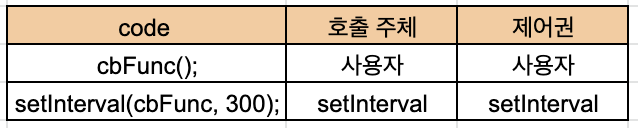

04-2 | 제어권
---
몇 가지 예제를 통해 구체적으로 살펴봅시다.

### 04-2-1 | 호출 시점
```javascript
// 예제 4-1 | 콜백 함수 예제(1-1) setInterval
var conunt = 0;
var timer = setInterval(function() {
    console.log(count);
    if(++count > 4) clearInterval(timer);
}, 300);
```

1번째 줄에서 count 변수를 선언하고 0을 할당했습니다. 2번째 줄에서는 timer 변수를 선언하고 여기에 setInterval을 실행한 결과를 할당했습니다. 
setInterval을 호출할 때 두 개의 매개변수를 전달했는데, 그중 첫 번째는 익명 함수이고 두 번째는 300이라는 숫자입니다. setInterval의 구조를 살펴보면 다음과 같습니다.

```javascript
var intervalID = scope.setInterval(func, delay[, param1, param2, ... ]);
```
우선 scope에는 Window 객체 또는 Worker의 인스턴스가 들어올 수 있습니다. 두 객체 모두 setInterval 메서드를 제공하기 때문인데, 일반적인 브라우저 환경에서는 window를 생략해서 함수처럼 사용 가능할 것입니다. 매개변수로 func, delay 값을 반드시 전달해야 하고, 세 번째 매개변수부터는 선택적입니다. func는 함수이고, delay는 밀리초(ms) 단위의 숫자이며, 나머지(param1, param2, ...)는 func 함수를 실행할 때 매개변수로 전달할 인자입니다.
func에 넘겨준 함수는 매 delay(ms)마다 실행되며, 그 결과 어떠한 값도 리턴하지 않습니다. setInterval를 실행하면 반복적으로 실행되는 내용 자체를 특정할 수 있는 고유한 ID 값이 반환됩니다. 이를 변수에 담는 이유는 반복 실행되는 중간에 종료(clearInterval)할 수 있게 하기 위해서 입니다.

다시 예제 4-1의 코드를 살펴봅시다. 그 전에, 좀 더 확인하기 쉽게 코드를 수정하겠습니다.
```javascript
// 예제 4-2 | 콜백 함수 예제(1-2) setInterval
var count = 0;
var cbFunc = function() {
    console.log(count);
    if(++count > 4) clearInterval(timer);
};
var timer = setInterval(cbFunc, 300);

// -- 실행 결과 --
// 0 (0.3초)
// 1 (0.6초)
// 2 (0.9초)
// 3 (1.2초)
// 4 (1.5초)
```

timer 변수에는 setInterval의 ID 값이 담깁니다. setInterval에 전달한 첫 번째 인자인 cbFunc 함수(이 함수가 곧 콜백 함수입니다.)는 0.3초마다 자동으로 실행될 것입니다. 콜백 함수 내부에서는 count 값을 출력하고, count를 1만큼 증가시킨 다음, 그 값이 4보다 크면 반복 실행을 종료하라고 합니다.

**표 4-1 | 코드 실행 방식과 제어권**
;

이 코드를 실행하면 콘솔창에는 0.3초에 한 번씩 숫자가 0부터 1씩 증가하며 출력되다가 4가 출력된 이후 종료됩니다. setInterval이라고 하는 '다른 코드'에 첫 번째 인자로서 cbFunc 함수를 넘겨주자 제어권을 넘겨받은 setInterval이 스스로의 판단에 따라 적절한 시점에(0.3초마다) 이 익명 함수를 실행했습니다. 이처럼 콜백 함수의 제어권을 넘겨받은 코드는 콜백 함수 호출 시점에 대한 제어권을 가집니다.

### 04-2-2 | 인자
```javascript
// 예제 4-3 | 콜백 함수 예제 (2-1) Array.prototype.map
var newArr = [10, 20, 30].map(function(currentValue, index) {
    console.log(currentValue, index);
    return currentValue + 5;
});
console.log(newArr);

// -- 실행 결과 --
// 10 0
// 20 1
// 30 3
// [15, 25, 35]
```

1번째 줄에서 newArr 변수를 선언하고 우항의 결과를 할당했습니다. 5번째 줄에서 그 결과를 확인하고자 합니다.
1번째 줄의 우항은 배열 [10, 20, 30]에 map 메서드를 호출하고 있습니다. 이때 첫 매개변수로 익명 함수를 전달합니다. 우선 map 메서드가 어떤 방식으로 동작하는지를 알아야 5번째 줄의 결과를 예상할 수 있을 것 같습니다. Array의 prototype에 담긴 map 메서드는 다음과 같은 구조로 이루어져 있습니다.

```javascript
Array.prototype.map(callback[, thisArg])
callback: function(currentValue, index, array)
```

map 메서드는 첫 번째 인자로 callback 함수를 받고, 생략 가능한 두 번째 인자로 콜백 함수 내부에서 this로 인식할 대상을 특정할 수 있습니다. thisArg를 생략할 경우에는 일반적인 함수와 마찬가지로 전역객체가 바인딩도비니다. map 메서드는 메서드의 대상이 되는 배열의 모든 요소들을 처음부터 끝까지 하나씩 꺼내어 콜백 함수를 반복 호출하고, 콜백 함수의 실행 결과들을 모아 새로운 배열을 만듭니다.
콜백 함수의 첫 번째 인자에는 배열의 요소 중 현재값이, 두 번째 인자에는 현재값의 인덱스가, 세 번째 인자에는 map 메서드의 대상이 되는 배열 자체가 담깁니다.

이를 바탕으로 예제 4-3을 다시 살펴보죠. 배열 [10, 20, 30]의 각 요소를 처음부터 하나씩 꺼내어 콜백 함수를 실행합니다. 우선 첫 번째(인덱스 0)에 대한 콜백 함수는 currentValue에 10이, index에는 인덱스 0이 담긴 채 실행되겠네요. 각 값을 출력한 다음, 15 ( 10 + 5 )를 반환할 것입니다.
두 번째(인덱스 1)에 대한 콜백 함수는 currentValue에 20이, index에는 1이 담긴 채로 실행되겠죠. 25 ( 20 + 5)를 반환하겠습니다. 같은 방식으로 세 번째에 대한 콜백 함수까지 실행을 마치고 나면, 이제는 [15, 25, 35] 라는 새로운 배열이 만들어져서 변수 newArr에 담기고, 이 값이 5번째 줄에서 출력될 것입니다.

제이쿼리(jQuery)의 메서드들은 기본적으로 첫 번째 인자에 index가, 두 번째 인자에 currentValue가 옵니다. 제이쿼리에 익숙한 독자라면 이런 순서가 더 자연스럽게 느껴질 수 있습니다. 만약 map 메서드를 제이쿼리의 방식처럼 순서를 바꾸어 사용해보면 어떨까요?

```javascript
// 예제 4-4 | 콜백 함수 예제(2-2) Array.prototype.map - 인자의 순서를 임의로 바꾸어 사용한 경우
var newArr2 = [10, 20, 30].map(function(index, currentValue) {
        console.log(index, currentValue);
        return currentValue + 5;
    });
console.log(newArr2);

// -- 실행 결과 --
// 10 0
// 20 1
// 30 2
// [5, 6, 7]
```

사람은 'index', 'currentValue' 등을 단어로 접근하기 때문에 순서를 바꾸더라도 각 단어의 의미가 바뀌지 않으니까 문제 없을 것이라고 생각하기 쉽지만, 사실 저 단어들은 사용자가 명명한 것일 뿐입니다.
컴퓨터는 그저 첫 번째, 두 번째의 **순서**에 의해서만 각각을 구분하고 인식할 것입니다.
우리가 첫 번째 인자의 이름을 'index'로 하건 'currentValue'로 하건 'noting'으로 칭하건 관계 없이 그냥 순회 중인 배열 중 현재 요소의 값을 배정하는 것입니다.
따라서 예제 4-4를 실행해보면 5번째 줄에서 [15, 25, 35]가 아닌 [5, 6, 7]이라는 전혀 다른 결과가 나옵니다
currentValue라고 명명한 인자의 위치가 두 번째라서 컴퓨터가 여기에 인덱스 값을 부여했기 때문입니다.

### 04-2-3 | this
3-1-4 절에서 "콜백 함수도 함수이기 때문에 기본적으로 this가 전역객체를 참조하지만, 제어권을 넘겨받을 코드에서 콜백 함수에 별도로 this가 될 대상을 지정한 경우에는 그 대상을 참조하게 된다"고 말하였다. 별도의 this를 지정하는 방식 및 제어권에 대한 이해를 높이기 위해 map 메서드를 직접 구현해 보겠습니다.
어떤 값을 받아 어떤 식으로 처리하는지는 4-2-2절에서 이미 소개했으니, 이런 요구사항에 부합하도록 만들기만 하면 되겠죠. 다음은 제가 임의로 작성한 map 메서드입니다. 예외 처리에 대한 내용은 모두 배제하고 동작원리를 이해하는 것을 목표로 핵심 내용만 작성했습니다.

```javascript
// 예제 4-5 | 콜백 함수 예제(2-3) Array.prototype.map - 구현
Array.prototype.map = function (callback, thisArg) {
    var mappedArr = [];
    for (var i = 0; i < this.length ; i++) {
        var mappedValue = callback.call(thisArg || window, this[i], i , this);
        mappedArr[i] = mappedValue;
    }
    return mappedArr;
}
```
메서드 구현의 핵심은 call/apply 메서드에 있습니다. this에는 thisArg값이 있을 경우에는 그 값을, 없을 경우에는 전역객체를 지정하고, 첫 번째 인자에는 메서드의 this가 배열을 가리킬 것이므로 배열의 i번째 요소 값을, 두 번째 인자에는 i 값을, 세 번째 인자에는 배열 자체를 지정해 호출합니다.
그 결과가 mappedValue에 담겨 mappedArr의 i번째 인자에 할당됩니다.

이제 this에 다른 값이 담기는 이유를 정확히 알 수 있겠네요. 바로 제어권을 넘겨받을 코드에서 call/apply 메서드의 첫 번째 인자에 콜백 함수 내부에서의 this가 될 대상을 명시적으로 바인딩하기 때문입니다.

```javascript
// 예제 4-6 | 콜백 함수 내부에서의 this
setTimeout(function() { console.log(this); }, 300);     // (1) Window { ... }

[1, 2, 3, 4, 5].forEach( function(x) {
    console.log(this);                                  // (2) Window { ... }
});


document.body.innerHTML += '<button id="a">클릭</button>';
document.body.querySelector('#a')
    .addEventListener('click', function(e) {
        console.log(this, e);                           // (3) <button id="a">클릭</button>
    });                                                 // MouseEvent { isTrusted: true, ... }
```

예제 4-6은 예제 3-11과 동일한 코드입니다. 각각 콜백 함수 내에서의 this를 살펴보면, 우선 (1)의 setTimeout은 내부에서 콜백 함수를 호출할 때 call 메서드의 첫 번째 인자에 전역객체를 넘기기 때문에 콜백 함수 내부에서의 this가 전역객체를 가리킵니다.
(2)의 forEach는 4-2-5절의 '별도의 인자로 this를 받는 경우'에 해당하지만 별도의 인자로 this를 넘겨주지 않았기 때문에 전역객체를 가리키게 됩니다. (3)의 addEventListener는 내부에서 콜백 함수를 호출할 때 call 메서드의 첫 번째 인자에 addEventListener 메서드의 this를 그대로 넘기도록 정의돼 있기 때문에 콜백 함수 내부에서의 this가 addEventListener를 호출한 주체인 HTML 엘리먼트를 가리키게 됩니다.


